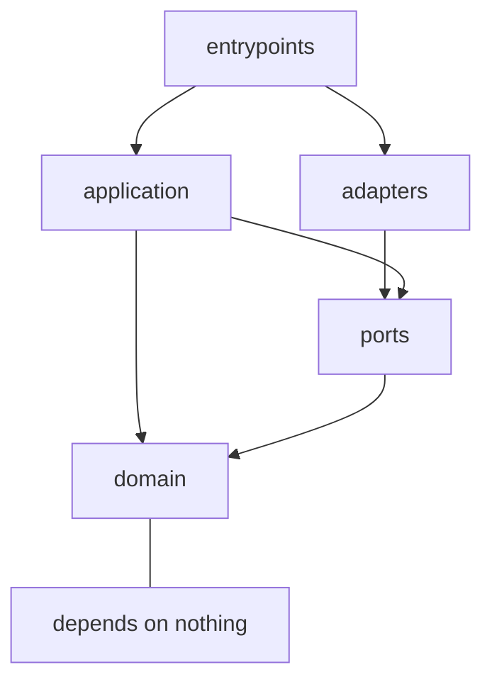
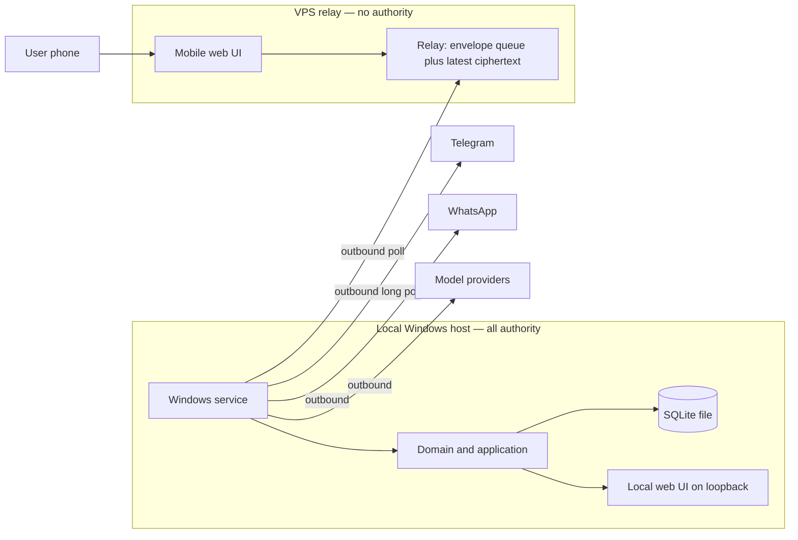
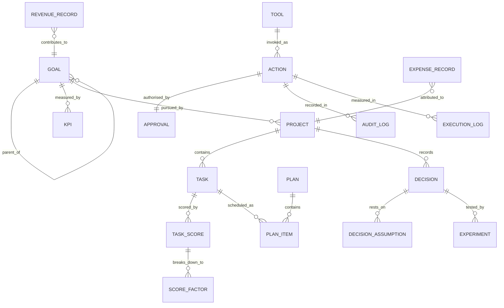

# Architecture Spine — Personal AI Operating System

## Design Paradigm

**Hexagonal (ports and adapters) around a deterministic core.**

The domain — goals, priority, planning, permission, the loop — is pure, deterministic, and has **no knowledge of** databases, LLMs, chat platforms, or the network. Everything external is an adapter behind a port owned by the core.

This is chosen because every volatile requirement in this system is at an edge: the database must be swappable, the LLM provider must be swappable, channels multiply, and deployment moves from local to local-plus-relay. Hexagonal makes each of those an adapter change instead of a redesign.

| Layer | Package | Contains |
|---|---|---|
| **Domain** | `aos/domain/` | Entities, value objects, invariants. No I/O, no imports from outside the domain. |
| **Application** | `aos/app/` | Loop stages, use cases, orchestration. Depends on ports only. |
| **Ports** | `aos/ports/` | Abstract interfaces the core owns: persistence, channel, model, tool, clock, secrets. |
| **Adapters** | `aos/adapters/` | Concrete implementations: SQLite, Postgres, Telegram, WhatsApp, relay, OpenAI/local models, tools. |
| **Entrypoints** | `aos/entrypoints/` | Windows service host, HTTP API, CLI. Wiring only. |

## Invariants & Rules



Dependencies point inward. `domain` imports nothing. `adapters` may never be imported by `application` or `domain` — only wired in at an entrypoint.

### AD-1 — The domain is deterministic; the LLM lives at an edge

- **Binds:** all
- **Prevents:** an LLM call appearing inside scoring, pace arithmetic, rollups, or scheduling — making results non-reproducible and untestable
- **Rule:** Priority scoring, goal arithmetic, trajectory, calibration and trigger evaluation are pure functions in `domain/`. They must be unit-testable with no network and no model. The model port is called only from `application/` to *interpret, explain, generate, or estimate a missing input* — never to produce a number the system reports as computed.

### AD-2 — Persistence is a port; no storage type escapes it

- **Binds:** all
- **Prevents:** SQLAlchemy models, SQL strings, or Mongo documents leaking into domain or application code, which would weld the system to one backend
- **Rule:** All persistence goes through repository interfaces in `ports/persistence/`. Domain and application code may not import any driver, ORM class, or query builder. Adapters translate between storage rows and domain entities. Selecting a backend is one config value (`AOS_DB_BACKEND`); no other code changes.

### AD-3 — Relational is the reference model; a document backend must conform to it

- **Binds:** persistence adapters
- **Prevents:** the data model degrading to a lowest common denominator to accommodate a document store, silently dropping the integrity the domain depends on
- **Rule:** The relational schema is the canonical model. Any non-relational adapter must enforce the same invariants (goal-tree acyclicity, `task.project_id` present, an action never existing without a resolved permission decision, append-only logs) in the adapter itself. An adapter that cannot enforce an invariant is non-compliant and must not be shipped.

### AD-4 — The relay has no authority

- **Binds:** relay component, channel adapters, permission model
- **Prevents:** a compromised public server being able to act on the local machine
- **Rule:** The server-side relay is a courier. It stores and forwards opaque envelopes, holds no plaintext, holds no credential that grants access to the local machine, and makes no permission decision. Every authorisation and every execution happens on the local host. **A fully compromised relay must be capable of nothing beyond denial of service.**

### AD-5 — The local host never accepts an inbound connection

- **Binds:** all networking
- **Prevents:** port forwarding, exposed local services, and router configuration becoming load-bearing
- **Rule:** All connections originate from the local host outward — Telegram long-polling, relay polling or outbound WebSocket, model APIs. No listening socket is exposed beyond `localhost`. The local web UI binds to loopback only.

### AD-6 — Channels are duplex command surfaces, not notification sinks

- **Binds:** channel adapters, notifier, application
- **Prevents:** a send-only notifier design that has to be rebuilt when replies must execute commands
- **Rule:** Every channel adapter implements both `send(Notification)` and `receive() -> InboundMessage`. Inbound messages from any channel route through one common command-intake path into the application layer. No channel gets a private execution path.

### AD-7 — Permission is evaluated locally, and L3 is not remotely grantable

- **Binds:** permission model, channels, relay, UI
- **Prevents:** a stolen phone or a compromised chat account authorising a destructive action
- **Rule:** Permission decisions are made only by the local permission service. L0–L2 may be requested and approved through any channel. **L3 approval is accepted only from the local UI on the local host** — never from relay, mobile web, WhatsApp, or Telegram. New tools default to L2. Unknown tool or unresolved approval means no execution.

### AD-8 — Append-only stores are enforced at the storage layer

- **Binds:** events, execution log, audit log
- **Prevents:** an update path appearing by convention drift, destroying the audit and learning guarantees
- **Rule:** `event`, `execution_log` and `audit_log` expose no update or delete operation in their repository interfaces. Enforcement is at the storage layer — database triggers or permissions — not application discipline alone. Corrections are new records that supersede, never edits.

### AD-9 — The assistant name is one configuration value

- **Binds:** all
- **Prevents:** a rename becoming a refactor
- **Rule:** `AGENT_NAME` (default `"Jarvis"`) is the sole source of truth. Code uses neutral identifiers everywhere — packages, modules, classes, tables, routes, env prefix `AOS_`. User-facing strings interpolate the config value. **CI fails if `grep -ri jarvis` over source returns a hit outside the config default and message templates.**

### AD-10 — The model provider is a port, selected per task class

- **Binds:** all model access
- **Prevents:** provider lock-in, and confidential context reaching a hosted model
- **Rule:** All model access goes through `ports/model/`. No provider SDK type appears outside its adapter. Provider and model are selected per task class by configuration. Any context containing a record classified `client-confidential` or `employer-confidential` may be routed **only** to a local provider; the router rejects the call otherwise.

### AD-11 — The scheduler emits requests; it never delivers

- **Binds:** scheduler, notifier, channels
- **Prevents:** channel knowledge spreading into scheduling, blocking the later relay lift
- **Rule:** The scheduler's only output is a `NotificationRequest` handed to the notifier. It has no knowledge of Telegram, WhatsApp, or any transport. Classification, budgeting, quiet hours, mode routing and fallback are the notifier's alone.

### AD-12 — Strategic goals are data, never code

- **Binds:** goal engine, priority engine
- **Prevents:** the system being welded to one user's current objective
- **Rule:** No strategic target, currency, threshold or goal name appears in source. Goal types are open via an evaluator strategy per type. **Acceptance: deleting every configured goal leaves a system that starts, runs and passes its tests.**

### AD-13 — Fetched content is data, never instruction

- **Binds:** all tools, application
- **Prevents:** prompt injection through web pages, issue bodies, file contents or inbound messages driving unapproved actions
- **Rule:** Content retrieved by any tool is inserted into model context as quoted, clearly-delimited data. Any action whose origin traces to fetched content is marked untrusted-origin and requires explicit approval **regardless of the tool's normal permission level**.

### AD-14 — Eight stores, distinct schemas, no generic blob

- **Binds:** persistence, memory
- **Prevents:** one undifferentiated memory table, which destroys retention rules, confidentiality routing and targeted retrieval
- **Rule:** Memory (user), State, Goals, Events, Decisions, Knowledge, Execution Log and Audit Log are separately schematised with separate repositories. A write addressed to the wrong store fails at the interface. Retrieval is store-targeted; there is no single similarity search spanning all stores.

### AD-15 — Screen capture leaves the host only as ciphertext

- **Binds:** screenshot capability, relay
- **Prevents:** desktop contents — including employer and client material — sitting in plaintext on a rented server
- **Rule:** Screenshots are encrypted on the local host with a key held only by the host and the user's viewing device. The relay stores ciphertext, retains only the most recent capture, and auto-deletes on a short TTL. Capture honours configurable blackout windows. The relay is never able to decrypt.

### AD-16 — Time is stored in UTC and evaluated in the user's zone

- **Binds:** scheduler, events, plans, reporting
- **Prevents:** DST and timezone drift causing triggers to double-fire or silently skip
- **Rule:** All timestamps persist as UTC. Schedule evaluation resolves against the configured local timezone. Temporal records carry both `occurred_at` and `recorded_at`, so retrospectively-entered facts sit correctly in time.

### AD-17 — One writer, guarded by a single-instance lock

- **Binds:** entrypoints, scheduler, Telegram adapter
- **Prevents:** two processes double-firing triggers, and duplicate Telegram polling (the API permits one polling connection per token)
- **Rule:** The service acquires an exclusive single-instance lock at startup and exits with a clear diagnostic if another holder exists. Scheduling and channel polling run only in the lock holder.

### AD-18 — Every side-effecting action is idempotent or duplicate-guarded

- **Binds:** executor, tools, relay intake
- **Prevents:** a crash, retry, or duplicate inbound message repeating a side effect
- **Rule:** Actions carry a client-generated idempotency key. A retry creates a **new** action linked to the original — terminal states are never reopened. Interruption mid-execution resolves to `FAILED` with `interrupted` set, never to success. Inbound relay messages are de-duplicated by message id.

### AD-19 — One command bootstraps and runs, everywhere

- **Binds:** entrypoints, setup, deployment
- **Prevents:** divergent setup paths for local and server, and a README of manual steps that rots
- **Rule:** A single executable file at the repository root is the only supported way to start the system. It is **idempotent**: it detects whether setup is complete, performs only the missing steps (virtual environment, dependencies, database creation, migrations, configuration scaffold, service registration), then starts. Re-running it on a healthy install starts the system without re-doing setup. The same file serves local and server; the target is detected or passed as one flag. Setup steps are individually re-runnable and never destructive to existing data.

### AD-20 — Code reads as written by a careful human

- **Binds:** all source
- **Prevents:** generated-looking code — narrating comments, oversized modules, deep nesting — accumulating past review
- **Rule:** Enforced mechanically, not by preference:

  | Limit | Value |
  |---|---|
  | Module length | ≤ 400 lines (CI fails above 500) |
  | Function length | ≤ 50 lines, target ≤ 25 |
  | Function parameters | ≤ 5 |
  | Cyclomatic complexity | ≤ 10 |
  | Nesting depth | ≤ 4 |
  | Line length | 100 |

  **Comments carry *why*, never *what*.** A comment restating the code is a defect. Docstrings appear on public port interfaces and non-obvious domain rules only; private helpers carry none. Names do the explaining — if a comment is needed to make a block readable, extract a named function instead. Type hints are mandatory on every public signature; `mypy` runs strict.

### AD-21 — Shared code lives in named, cohesive modules — never a junk drawer

- **Binds:** `common/`
- **Prevents:** both duplicated logic and the `utils.py` grab-bag that becomes an unmaintainable dependency magnet
- **Rule:** Cross-cutting helpers live in `aos/common/` in modules named for their single subject — `money.py`, `timeutil.py`, `ids.py`, `redaction.py`, `result.py`. **A module named `utils`, `helpers`, `misc` or `shared` is forbidden.** `common/` may import from `domain/` but never from `app/`, `adapters/` or `entrypoints/`. Extract on the third occurrence, not the first — premature sharing couples more than it saves.

### AD-22 — Every derived value has exactly one writer

- **Binds:** priority scores, goal rollups, trajectory, required pace, calibration factors
- **Prevents:** one component treating a value as computed-on-read while another treats it as stored, so the plan ranks by fresh numbers while the dashboard shows stale ones — with neither in breach
- **Rule:** Each derived value declares a single owning component that computes and persists it, stamped with the version of the inputs it was computed from. Readers **read**; they never opportunistically recompute. A reader detecting a stale stamp requests recomputation from the owner rather than doing it locally.

### AD-23 — Notifications are deduplicated by a deterministic key

- **Binds:** notifier, scheduler, proactive-signal generation
- **Prevents:** two compliant producers raising the same real-world event twice — the exact notification fatigue P-6 and NFR-8 exist to avoid
- **Rule:** Every notification carries a dedupe key derived from (trigger identity, target occurrence). The notifier collapses duplicate keys within a configured window and records the suppression. The notification budget counts **occurrences**, not emissions.

### AD-24 — Confidentiality fails closed

- **Binds:** memory, model routing, all writers
- **Prevents:** an unclassified record silently defaulting to a permissive class and leaking client work to a hosted model
- **Rule:** Classification is **mandatory at write** and storage rejects null. Any record whose provenance cannot be established is assigned the **most restrictive** class, not the most convenient. There is no permissive default anywhere in the system. Model routing denies on absence, never permits on absence.

### AD-25 — The relay envelope is versioned and opaque

- **Binds:** relay, local agent, channel adapters
- **Prevents:** version skew between two separately-deployed components silently dropping traffic
- **Rule:** Every envelope carries an explicit schema version. The relay treats the payload as opaque and **forwards unknown versions untouched** rather than rejecting them. Outer-field changes are additive only, and no newly added field may become required for routing. The relay is never updated in lockstep with the agent, because it cannot be.

### AD-26 — The system watches itself

- **Binds:** service host, scheduler, notifier
- **Prevents:** silent death — the realistic failure mode for an always-on local service, and the one that destroys the product's entire value
- **Rule:** The service writes a heartbeat on every loop pass. A missed heartbeat beyond a configured threshold is surfaced on next start alongside missed triggers (NFR-20). Startup failure, scheduler stall, and channel-adapter disconnection each raise a visible, user-facing signal — never a log line alone.

## Consistency Conventions

| Concern | Convention |
|---|---|
| Naming — packages, modules | `snake_case`, neutral vocabulary only (`agent`, `assistant`, `core`); never the assistant's name (AD-9) |
| Naming — entities, tables | Singular `snake_case` (`goal`, `task`, `audit_log`); domain classes `PascalCase` matching the Glossary term verbatim |
| Naming — ports, adapters | Port `XRepository` / `XPort`; adapter `<Backend>X` (`SqliteGoalRepository`, `TelegramChannel`) |
| Naming — env vars | `AOS_` prefix, uppercase (`AOS_DB_BACKEND`, `AGENT_NAME`) |
| Identifiers | UUIDv7 as `str` — sortable, backend-portable, safe across relational and document stores |
| Dates and times | UTC, ISO 8601 with explicit offset, persisted as UTC (AD-16) |
| Money | Integer minor units plus an ISO 4217 currency code. Never float. |
| Errors | Domain raises typed domain exceptions; adapters translate foreign errors at the boundary; no driver exception escapes an adapter |
| Envelopes | Every relay payload is `{id, kind, created_at, nonce, ciphertext}` — the relay reads only the outer fields |
| State mutation | Entities mutate only through domain methods that preserve invariants; repositories persist whole aggregates, never partial field writes |
| Logging | Structured JSON, correlation id per loop pass and per action; secrets redacted by classification before write |
| Configuration | `pydantic-settings`, typed, layered file → env; secrets never in config files (AD-9, secrets port) |
| Migrations | Alembic owns relational schema; every schema change ships a migration; no implicit table creation in production paths |
| Testing | Domain and application tested against in-memory fake adapters; each real adapter has a contract test suite proving it satisfies its port identically |

## Stack

Seed, not contract — the code owns this once `pyproject.toml` exists. Rows marked **unpinned** were not version-verified at authoring and are pinned at first install from the resolved lockfile; everything else was checked against live sources on 2026-08-10.

| Name | Version |
|---|---|
| Python | 3.12+ |
| FastAPI | unpinned |
| Uvicorn | unpinned |
| SQLAlchemy | 2.x |
| Alembic | unpinned |
| SQLite | bundled with Python (MVP default backend) |
| PostgreSQL | 16+ (second supported backend) — asserted, confirm at the phase-2 lift |
| APScheduler | **3.11.x** — 4.0 remains in development and redesigned its stores incompatibly |
| python-telegram-bot | 22.8 (requires Python ≥3.10) |
| pydantic-settings | latest stable |
| keyring | latest stable — Windows DPAPI backed |
| Windows Task Scheduler | built in — at-startup trigger, *run whether the user is logged on or not*. **Not NSSM**: verified as having had no stable release in over a decade. WinSW is the fallback if true service-control semantics are needed later. |
| Ruff | unpinned — lint **and** format; replaces black, isort, flake8, pyupgrade |
| mypy | unpinned — strict mode |
| pytest | unpinned |
| uv | optional accelerator — the bootstrap uses it when present and falls back to stdlib `venv` + `pip`, so Python alone is the only prerequisite |
| VPS | India region (Mumbai / Bangalore) — sub-35ms domestic; **not** Hetzner at 180–220ms from India |

## Structural Seed

### Deployment



The local host initiates every connection. The relay accepts inbound traffic from the phone and holds envelopes until the local host collects them.

### Core entities



### Source tree

`src/` layout, `pyproject.toml` as the single source of truth — the 2026 Python standard.

```text
run.py               # THE entrypoint (AD-19): setup-if-needed, then start
pyproject.toml       # deps, ruff, mypy, pytest config — one source of truth
src/aos/
  common/            # named cohesive helpers only (AD-21); never a utils junk drawer
  domain/            # entities, value objects, invariants — imports nothing
    goal/            # goal tree, rollup, pace, trajectory
    priority/        # scoring, bands, factors
    planning/        # plan, protected blocks, replan
    permission/      # levels, approval state machine
    memory/          # the eight store models
  app/               # loop stages and use cases; depends on ports only
    loop/            # goal, prioritize, execute, measure, learn, replan
    intake/          # one command-intake path for every channel
  ports/             # interfaces the core owns
    persistence/     # repository per store
    channel/         # send + receive (duplex)
    model/           # completion, embedding, tool-calling
    tool/            # registry and invocation
    system/          # clock, secrets, screen capture, single-instance lock
  adapters/
    persistence/
      sqlite/        # MVP default
      postgres/      # second backend, same SQLAlchemy core
    channel/
      telegram/
      whatsapp/
      relay/         # outbound-only client to the VPS relay
    model/
    tool/
    system/
  entrypoints/
    service/         # Windows service host — wiring only
    api/             # FastAPI app, loopback bound
    cli/
relay/               # separately deployed VPS component; no domain import
migrations/          # Alembic
tests/
  contract/          # every adapter proves it satisfies its port identically
```

**Host context.** This system runs on the user's **personal** machine. His Gate6 work happens on a **separate official machine**, so employer material is not present on this host and cannot appear in screenshots or model context. **Client-confidential material remains in scope** — freelance client work is done at home on this same machine — so the classification and routing rules of AD-10 and AD-15 stand, weighted toward client rather than employer.

## Operational Envelope

The system's value depends entirely on it running unattended for months and firing at 06:00 the morning after a reboot. That makes operations part of the architecture, not an afterthought.

### Environments

| Environment | Data | Channels | Runs as |
|---|---|---|---|
| **dev** | Throwaway database, seeded fixtures | Stubbed adapters — no real message is ever sent | Foreground process |
| **live** | The real memory stores | Real Telegram, WhatsApp, relay | Startup task, no login required |

One config value selects the environment. **A dev run can never deliver to a real channel** — the adapter set is chosen by environment, not by a flag a developer might forget. Dev and live never share a database file.

### Startup and supervision

- Registered with Windows Task Scheduler: **at startup**, *run whether the user is logged on or not*, restart-on-failure enabled — so an overnight reboot does not silently cost the 06:00 nudge.
- Single-instance lock (AD-17) is acquired before the scheduler or any channel poller starts.
- The welcome message on start doubles as the liveness signal the user actually sees.

### Upgrade

- `run.py` is the only upgrade path (AD-19): stop, pull, re-run. It detects the new version, applies pending migrations, and restarts.
- **Migrations run forward-only and must be safe to apply to a live database with data.** A migration that cannot be applied without data loss is a defect, not a release note.
- A failed upgrade leaves the previous version running rather than a half-migrated system.

### Relay deployment

- The relay is a separate deployable with no domain import; it ships and rolls back independently (AD-25 exists precisely because these two versions drift).
- Rollback is redeploying the prior version — the relay holds no durable state worth preserving beyond in-flight envelopes.

### Self-monitoring

- Heartbeat per loop pass (AD-26). A gap beyond threshold is reported to the user on next start.
- Channel-adapter disconnection, scheduler stall, and startup failure each raise a visible signal, never a log line alone.
- Operational metrics (FR-92) are queryable locally: executions, latency, errors, token cost.

### Backup and restore

- **[PROPOSED]** Daily local copy of the database file plus the secrets store, retained 30 days.
- **Restore is exercised, not assumed** — an untested backup is not a backup. A restore drill is part of the M2 exit criteria, since that is the milestone where the data first becomes irreplaceable.

## Capability → Architecture Map

| Capability / Area | Lives in | Governed by |
|---|---|---|
| Loop stages (CFR-1–CFR-34) | `app/loop/` | AD-1, AD-12 |
| Goal and KPI engine (FR-6–FR-11) | `domain/goal/` | AD-1, AD-12 |
| Priority engine (FR-12–FR-16) | `domain/priority/` | AD-1 |
| Planning and replanning (FR-17–FR-24) | `domain/planning/` | AD-1 |
| Scheduler (FR-25–FR-28) | `app/loop/`, `adapters/system/` | AD-11, AD-16, AD-17 |
| Notifier and channels (FR-29–FR-33) | `ports/channel/`, `adapters/channel/` | AD-6, AD-11 |
| Executor and tools (FR-34–FR-37) | `ports/tool/`, `adapters/tool/` | AD-13, AD-18 |
| Permission and approval (FR-38–FR-41) | `domain/permission/` | AD-4, AD-7 |
| Memory, eight stores (FR-42–FR-44) | `domain/memory/`, `ports/persistence/` | AD-2, AD-3, AD-8, AD-14 |
| Revenue and expenses (FR-80–FR-104) | `domain/goal/` | AD-1, conventions (money) |
| Remote view and command | `relay/`, `adapters/channel/relay/` | AD-4, AD-5, AD-15 |
| Naming discipline (FR-95) | everywhere | AD-9 |

## Deferred

| Deferred | Why it can wait |
|---|---|
| **MongoDB adapter** | The port and repository seam exist now (AD-2), so an adapter is additive. Building it before a concrete need doubles data-layer work and risks weakening the relational invariants of AD-3. Revisit when a requirement actually calls for a document store. |
| **Vector store / semantic search** | `sqlite-vec` is still pre-beta by its own documentation. Not needed until the Knowledge store matters at M2+. Choose then, behind the persistence port. |
| **Voice engines (STT/TTS)** | Milestone M6. Local versus cloud is an open privacy trade — a hosted engine ships audio off the host, which interacts with AD-10. |
| **WhatsApp transport choice** | Unofficial bridge on a dedicated number versus paid Business API. Both sit behind the same duplex channel port (AD-6), so the decision is adapter-local and can be made at M1's end. |
| **Ringing wake-up mechanism** | Local machine alarm, PSTN call, or escalating messages. Adapter-local behind the notifier (AD-11). |
| **Live screen streaming** | Stage 1 is on-demand encrypted screenshot (AD-15). WebRTC streaming only if screenshots prove insufficient; it must remain peer-to-peer and never relay video through the ₹1500/month VPS. |
| **Agent office visualisation** | UX layer over existing worker-role data. No architectural consequence; list view first. |
| **Priority engine weights** | Configuration, not structure. Needs the user's calibration. |
| **Backup and restore beyond a daily local file copy** | Single-user, single-host at MVP. Revisit at the relay lift. |
| **Multi-user, tenancy, auth beyond single-owner** | Explicit non-goal for this system. A future Naxova product is a separate build. |
